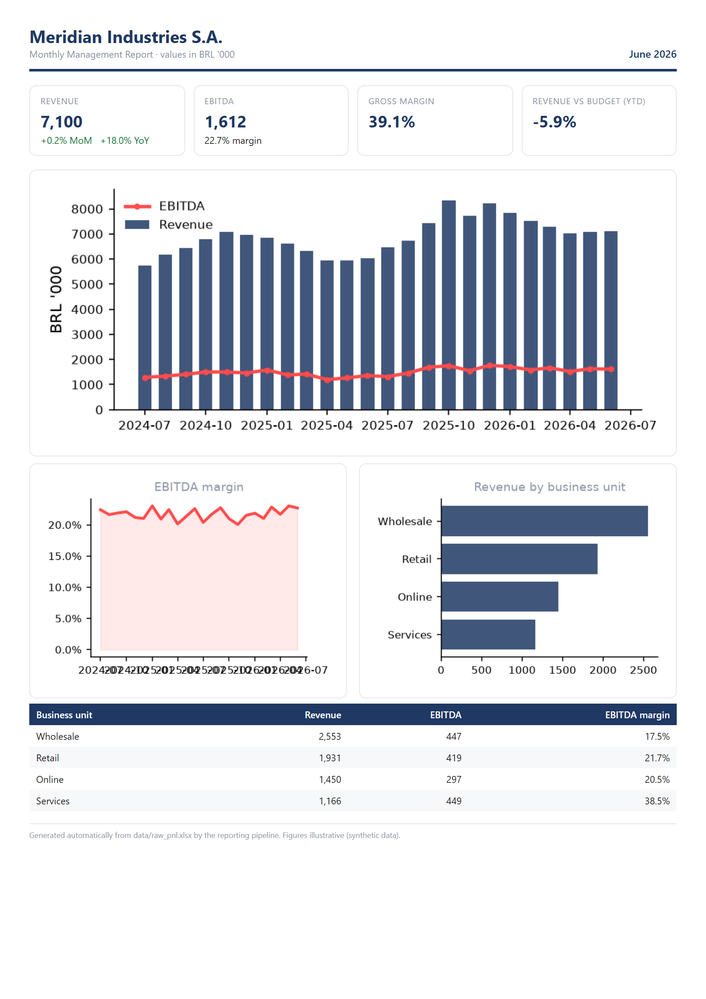
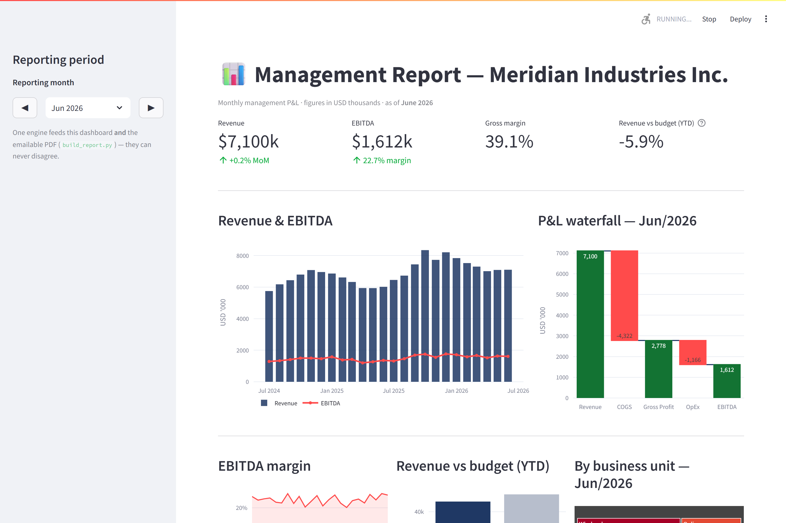

# Financial Report Pipeline

[](https://ap-financial-report.streamlit.app/)

**▶ Try it live: [ap-financial-report.streamlit.app](https://ap-financial-report.streamlit.app/)** — no install required.

Turn a messy, manually-maintained monthly **P&L spreadsheet** into a polished
**PDF report** *and* a live **interactive dashboard** — from one script, on
every refresh.

The pitch in one line: **one engine, two renderers.** The same calculation
layer feeds both the emailable PDF finance teams expect and the dashboard that
replaces it, so the two can never disagree — and nobody re-keys numbers by hand.

> Built around a realistic pain: a controller keeps a workbook by hand and
> emails a static PDF every month. This pipeline ingests that exact workbook and
> regenerates both outputs automatically.

---

## Before → After

| The "before" — raw workbook | The "after" — live dashboard |
|---|---|
| A human-formatted sheet: title banners, business units stacked in blocks, months pivoted across columns, blank spacer rows. Painful to analyze. | Pick the reporting month and watch KPIs, the P&L waterfall, trends, budget variance and the business-unit breakdown update live. |

**Auto-generated PDF** (the traditional one-pager, produced for free from the same data):



**Interactive dashboard** (the upgrade):



---

## How it works

```
data_gen.py        # creates the messy "before" workbook  -> data/raw_pnl.xlsx
report_engine.py   # THE ENGINE: parse messy sheet -> tidy data -> P&L, KPIs, variance
build_report.py    # renders the static PDF (HTML + matplotlib -> Chromium print)
app.py             # renders the interactive Streamlit dashboard
```

`report_engine.py` is the single source of truth. It:
- parses the manual layout (forward-fills business-unit names, drops spacer
  rows, un-pivots the month columns) into a tidy `[date, business_unit,
  account, value]` table;
- derives the P&L — Gross Profit, OpEx, EBITDA and margins;
- computes MoM / YoY growth and YTD revenue-vs-budget variance.

Both renderers import this module, so the PDF and the dashboard are guaranteed
to show the same numbers.

## Quickstart

```bash
pip install -r requirements.txt
python data_gen.py            # generate the sample workbook
streamlit run app.py          # launch the dashboard
```

Generate the PDF as well (optional extra deps):

```bash
pip install -r requirements-pdf.txt
python -m playwright install chromium
python build_report.py        # -> data/management_report.pdf
```

## Design notes

- **Realistic, messy input on purpose.** The value isn't a clean CSV in — it's
  ingesting the human-formatted workbook teams actually keep.
- **One engine, two renderers.** The recurring source of reporting errors is
  numbers re-keyed across formats; a shared engine removes it.
- **Swappable scenario.** The engine's domain knowledge is a handful of account
  roles, so re-pointing the pipeline at a different report (e.g. sales by
  region) is a small change, not a rewrite.
- **Self-contained demo.** Deterministic synthetic data; no real figures, no
  external services required to run.

## Tech

Python · pandas · numpy · openpyxl · plotly · streamlit · matplotlib · jinja2 · playwright
